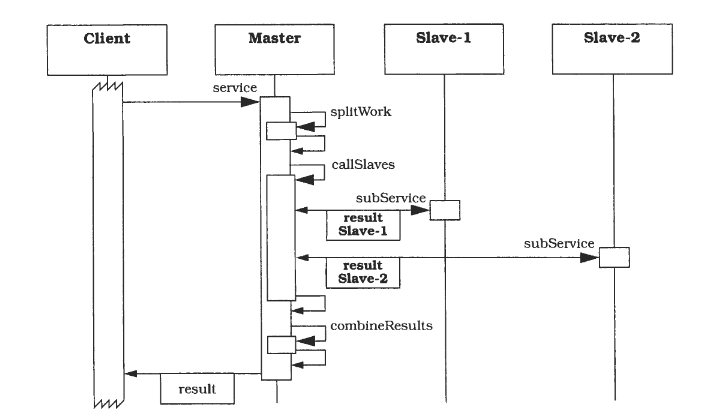
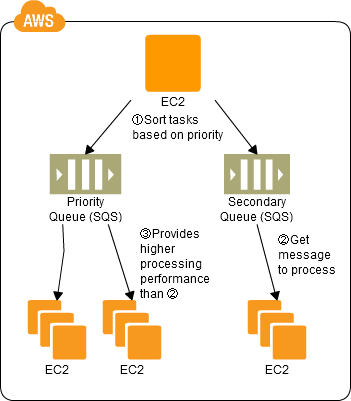

## Design patterns have been critized for being too specific and artifically limited by OO language constraints. Find and describe any pattern that may be useful in building software. Define and describe 3 patterns that you have found.

**1. Master Slave Pattern:**

Master slave pattern is a pattern for organizing work within a system.
The Master-Slave pattern supports fault tolerance,  parallel computation and computational  accuracy. A master component distributes work to identical slave components and computes a final result from the results these slaves return.

Master-Slave applies the 'divide and conquer' principle. Work is partitioned  into several subtasks that are processed  independently. The result of the whole  service is calculated using the results that each partial processing operation provides. The Master-Slave pattern is widely applied in the areas of parallel and distributed computing. 

**Example :** The traveling-salesman problem is well-known in graph theory. The task is to find an optimal round trip between a given set of  locations, such as the shortest trip that visits each location exactly once. The solution to this problem is of high computational complexity and is NP complete.

To solve the master slave problem, the following considerations need to be taken:

1. **Divide work :** Specify how the computation of  the task can be split into a set of  equal sub-tasks. Identify the sub-services that are necessary to process a sub-task. 
	
2. **Combine sub-task results :** Specify how the final result of the whole service can be computed with the help of the results obtained from processing individual sub-tasks. 

3. **Specify the  cooperation between master and slaves :** Define an interface for the sub-service identified in step 1. It will be implemented by the slave and used by the master to delegate the processing of indi- vidual sub-tasks

###### Reference : Pattern-Oriented Software Architecture Volume 1: A System of Patterns Volume 1 Edition by Frank Buschmann  (Author), Regine Meunier (Author), Hans Rohnert (Author), Peter Sommerlad (Author), Michael Stal (Author)
------

**2. Priority Queue Pattern**

Priority Queue pattern is a cloud design pattern used when there are cases where a large number of batch jobs may need processing, and where the the jobs may need to be re-prioritized.

**Example :**
An example case is one where there are differences between different levels of services for unpaid users versus subscriber users (such as the time until publication) in services enabling, for example, presentation files to be uploaded for publication from a web browser. When the user uploads a presentation file, the conversion processes, for example, for publication are performed as batch processes on the system side, and the file is published after the conversion. Is it then necessary to be able to assign the level of priority to the batch processes for each type of subscriber.

A queue is used in controlling batch jobs. The queue need only be provided with priority numbers. Job requests are controlled by the queue, and the job requests in the queue are processed by a batch server. In Cloud computing, a highly reliable queue is provided as a service, which you can use to structure a highly reliable batch system with ease. You may prepare multiple queues depending on priority levels, with job requests put into the queues depending on their priority levels, to apply prioritization to batch processes. The performance (number) of batch servers corresponding to a queue must be in accordance with the priority level thereof.
 
**Implementation**

In AWS, the queue service is the Simple Queue Service (SQS). Multiple SQS queues may be prepared to prepare queues for individual priority levels (with a priority queue and a secondary queue). Moreover, you may also use the message Delayed Send function to delay process execution.

Use SQS to prepare multiple queues for the individual priority levels.
Place those processes to be executed immediately (job requests) in the high priority queue.
Prepare numbers of batch servers, for processing the job requests of the queues, depending on the priority levels.
Queues have a message "Delayed Send" function. You can use this to delay the time for starting a process.

###### Reference : http://en.clouddesignpattern.org/index.php/CDP:Priority_Queue_Pattern
